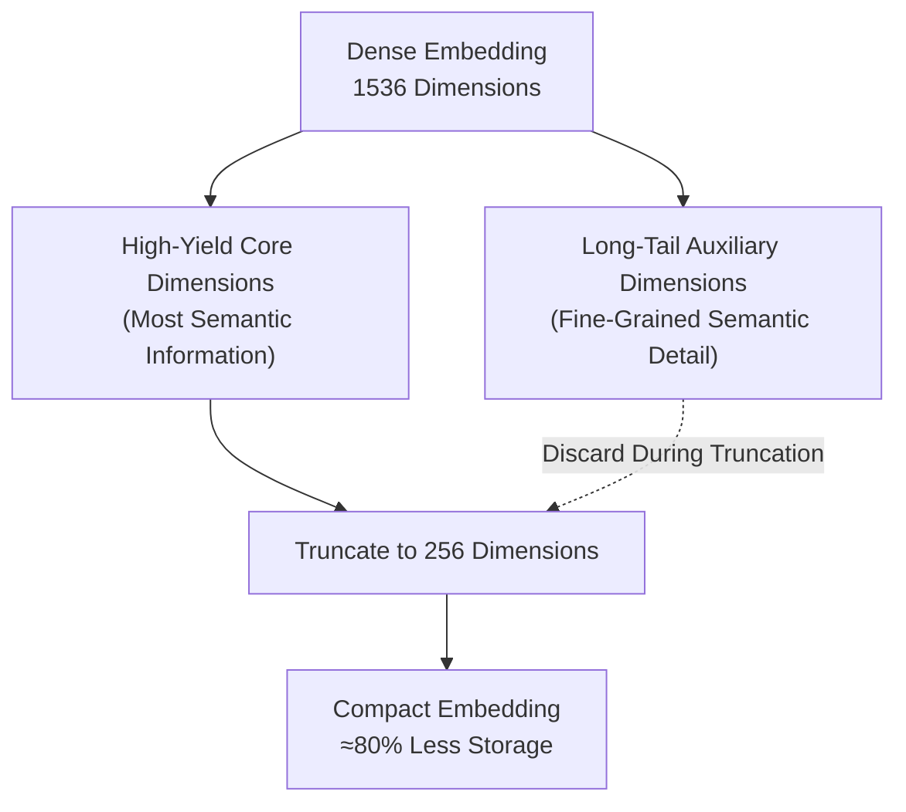

  

  
  
  <!-- MORE BADGES HERE -->

# 🌌 Awesome-Embedding-Layers

  <strong>Comprehensive Curated List of Embedding Layers in Artificial Intelligence, Machine Learning, and Deep Learning</strong>
   
  <em>Keywords: AI, Machine Learning, Embedding Layers, Vector Database, LLM, Neural Networks, Deep Learning, Vision Transformers, RoPE</em>

## 🧠 Embedding Layers in AI: History, Progression, Variants, & Applications

An **Embedding Layer** is a foundational structural component in deep learning architectures designed to transform discrete, high-dimensional categorical tokens (such as individual word IDs, user keys, or pixel values) into low-dimensional, continuous-valued dense vectors. In early machine learning infrastructure, discrete features were represented via sparse **One-Hot Encoding** arrays, where each token was mapped to an isolated binary vector whose length matched the absolute size of the vocabulary. This created severe memory bottlenecks and treated all entities as orthogonally independent, rendering the system incapable of tracking relational affinity. 

Embedding layers solve this crisis by acting as a learnable lookup table ($W \in \mathbb{R}^{|V| \times d}$). By projecting discrete tokens into a continuous coordinate space (the embedding dimension), the layer compresses sparse data, maps semantic similarities geometrically via vector distance metrics (like Cosine Similarity), and serves as the mandatory entryway for modern Vision Transformers and Large Language Models [INDEX: 1, 10].

---

## 📅 1. The Macro Chronological Evolution

The implementation of continuous layer tokenization has transitioned from static non-contextual lookups to deep recurrent sequence captures, parallel self-attention matrices, and modern multi-modal patch-fused latent workspaces.

| Era | Description | Year First Used | Paper Link |
| :--- | :--- | :--- | :--- |
| [**The Sparse One-Hot & Lookup-Free Era (Traditional ML Baseline)**](pages/the-sparse-one-hot-lookup-free-era-traditional-ml-baseline.md) | *Concept:* The entry-level categorical standard. Features were tokenized using flat index arrays. For a vocabulary size of 50,000 words, the token for the word `apple` was a sparse vector containing a single `1` at its unique index and 49,999 zeros everywhere else.  *Limitation:* Catastrophically inefficient memory allocation and absolute semantic blindness. The distance between *any* two unique tokens was mathematically identical, meaning the system could not tell that `apple` and `orange` share a tighter relationship than `apple` and `cpu`, capping cross-token tracking bounds. | Pre-2013 | N/A |
| [**The Static Continuous Feature Lookup Era (Word2Vec / GloVe, 2013–2017)**](pages/the-static-continuous-feature-lookup-era-word2vec-glove-2013-2017.md) | *Concept:* Sparked the connectionist representation boom by proving that continuous vector directions could capture abstract human meaning natively from unlabelled text data. Algorithms like **Word2Vec (2013)** trained shallow networks on local contextual windows, producing an immutable, global embedding matrix where geometric offsets replicated algebraic logic (e.g., the famous vector identity: $\overrightarrow{\text{king}} - \overrightarrow{\text{man}} + \overrightarrow{\text{woman}} \approx \overrightarrow{\text{queen}}$).  *Limitation:* Rigidly non-contextual. A word was locked to exactly *one* static spatial coordinate vector, completely failing to resolve polysemy (e.g., mapping the word `bank` to the identical coordinate whether it meant a financial institution or a river edge). | 2013 | [Mikolov et al. (2013)](#references), [Pennington et al. (2014)](#references) |
| [**The Deep Dynamic Contextual Projection Era (ELMo / BERT, ~2018–2022)**](pages/the-deep-dynamic-contextual-projection-era-elmo-bert-2018-2022.md) | *Concept:* Solved the polysemy bottleneck by shifting tokenization from hardcoded lookup rows to dynamic hidden state projections. While the model still utilizes a static embedding table as its raw entry gate step zero, the vector is instantly passed through deep **Self-Attention or Recurrent layers** [INDEX: 1].  *Significance:* The final output embedding for a token is dynamically computed as a function of the *entire surrounding sequence sentence*, allowing the model to shift coordinate representations seamlessly based on local semantic clues [INDEX: 1]. | 2018 | [Devlin et al. (2018)](#references) |
| [**The Omni-Directional Patch & Quantized Token Era (~2023–Present)**](pages/the-omni-directional-patch-quantized-token-era-2023-present.md) | *Concept:* The current modern state-of-the-art foundation standard. It Ported embedding layers out of narrow, text-only domains to handle multi-sensory streams inside a monolithic transformer architecture [INDEX: 1, 10]. Input graphics are sliced into 2D structural pixel blocks projected linearly via an image embedding layer (**Vision Transformers - ViTs**), while continuous audio waveforms are snapped to discrete coordinates using vector-quantized codebooks [INDEX: 5, 10].  *Significance:* Merges sight, acoustics, and string characters into a single, unified shared embedding workspace natively, allowing cross-modal token strings to co-adapt features concurrently [INDEX: 10]. | 2020 | [Dosovitskiy et al. (2020)](#references), [Radford et al. (2021)](#references) |

---

## ⚙️ 2. Core Functional & Compression Variants

Embedding layers are strictly categorized based on how parameters are initialized, mapped, and mathematically regularized across the optimization graph.

| Variant | Mechanism / Pros & Cons | Year First Used | Paper Link |
| :--- | :--- | :--- | :--- |
| [**A. Token Lookup Embedding Layers (Standard Baseline)**](pages/a-token-lookup-embedding-layers-standard-baseline.md) | *Mechanism:* Functions as a simple parameterized weight matrix multiplication where input token IDs act as hot indices. A forward pass step zero is mathematically equivalent to fetching the $i$-th row of the weight tensor via an optimized pointer lookup, bypassing heavy matrix multiplication cycles.  *Condition:* Requires strict vocabulary masking and absolute input padding tracking to handle variable-length sequences cleanly. | Pre-2013 | N/A |
| [**B. Linear Patch Embedding Layers (ViT Vision Frontends)**](pages/b-linear-patch-embedding-layers-vit-vision-frontends.md) | *Mechanism:* Ingests a high-resolution pixel canvas ($X \in \mathbb{R}^{H \times W \times C}$) [INDEX: 5]. The module applies a 2D convolutional layer with a kernel size and stride exactly equal to the targeted patch dimension (typically $14 \times 14$ or $16 \times 16$) [INDEX: 5]. This flattens the local spatial arrays into a linear sequence of dense vector channels, projecting image blocks like text words [INDEX: 5]. | 2020 | [Dosovitskiy et al. (2020)](#references) |
| [**C. Adaptive / Tiered Embedding Tables**](pages/c-adaptive-tiered-embedding-tables.md) | *Mechanism:* Formulated to resolve memory-bandwidth bottlenecks when dealing with massive vocabulary dictionaries (e.g., >256,000 international tokens). It assigns wide, high-precision channels to frequent tokens (like `the`), while assigning thin, highly compressed channels to rare technical tokens, deploying linear projections to align dimensions before passing tensors to hidden states. | 2019 | N/A |
| [**D. Rotary & Geometric Position Embeddings (RoPE)**](pages/d-rotary-geometric-position-embeddings-rope.md) | *Mechanism:* Moves away from adding flat static value coordinates to token tensors [INDEX: 18]. Instead, it multiplies the query and key embedding vectors by a complex rotation matrix inside the self-attention block [INDEX: 18].  *Pros:* Encodes relative chronological distance and time offsets geometrically as an angle, allowing context windows to scale past 128k+ thresholds cleanly without feature distortion [INDEX: 18, 22]. | 2021 | [DeepSeek-AI (2025)](#references) |

---

## 🗜️ 3. High-Capacity Dimension Reduction & Compression Classes

To deploy massive embedding vocabularies across resource-constrained edge systems or high-throughput servers, engineering frameworks implement specialized loss constraints.

| Class | Profile / Significance | Year First Used | Paper Link |
| :--- | :--- | :--- | :--- |
| [**Matryoshka Representation Learning (MRL Losses)**](pages/matryoshka-representation-learning-mrl-losses.md) | *Profile:* Dynamic nesting vector truncation. It forces the optimizer to pack the absolute most critical semantic signals into the *earliest coordinates* of the vector stream during contrastive pre-training.  *Significance:* Unlocks **Adaptive Vector Slicing**. Developers can cleanly truncate a model's output embedding from 1536 dimensions down to 256 dimensions at runtime, saving up to 80% on vector database storage footprints while maintaining 98%+ of the baseline retrieval accuracy. | 2022 | [Kusupati et al. (2022)](#references) |
| [**Vector Quantization Codebooks (VQ-VAE / Tokenizers)**](pages/vector-quantization-codebooks-vq-vae-tokenizers.md) | *Profile:* Discretizes continuous spaces. Projects a high-dimensional continuous latent feature map onto its nearest matching vector row inside a discrete lookup dictionary, converting smooth acoustic or visual waves into sharp, integer token sequences. | 2017 | N/A |

---

## 🏭 4. Production Engineering Challenges & Hardware Solutions

Scaling embedding tables to match web-scale multilingual vocabularies introduces intense VRAM allocation caps and memory-bus bottlenecks.

| Challenge | Problem / Mitigation | Year First Used | Paper Link |
| :--- | :--- | :--- | :--- |
| [**The Vocabulary Parameter Memory Wall**](pages/the-vocabulary-parameter-memory-wall.md) | *The Problem:* Expanding an embedding layer to support expansive international scripts, emoticons, and source-code token vocabularies swells the matrix parameters. A 256,000 vocabulary size combined with a model dimension ($d_{model}$) of 8,192 demands over 2 billion parameters *strictly for the step-zero embedding layer*, consuming gigabytes of precious GPU VRAM before a single hidden layer is even processed.  *Mitigation:* Implementing **Factorized Embedding Parameterization (AlBERT style)**, which decouples vocabulary size from hidden dimensions by projecting tokens first into a tiny latent space ($E \ll d_{model}$) before up-scaling via a linear layer, saving up to 80% table memory. | 2019 | N/A |
| [**The Sparse Embedding Lookup Memory-Bandwidth Bottleneck**](pages/the-sparse-embedding-lookup-memory-bandwidth-bottleneck.md) | *The Problem:* While standard linear layer operations are heavily bounded by raw compute (FLOPs), embedding lookups are strictly bottlenecked by **Memory Bandwidth**. Fetching disjointed rows randomly from a giant embedding matrix forces the GPU to execute unstructured, sparse memory access loops, saturating the bus and stalling tensor cores.  *Mitigation:* Compiling lookup layers using **Fused CUDA/Triton Kernels**, block-aligning rows to ensure parameter streaming operates contiguously inside GPU SRAM registers, or sharding the embedding table across host CPU memory using specialized parameter servers. | N/A | N/A |

---

## 🚀 5. Frontier Real-World AI Industrial Applications

| Application | Details | Year First Used | Paper Link |
| :--- | :--- | :--- | :--- |
| [**Enterprise Retrieval-Augmented Generation (RAG Ingestion Layers)**](pages/enterprise-retrieval-augmented-generation-rag-ingestion-layers.md) | *Application:* Serves as the critical baseline entry tier powering corporate AI knowledge retrieval [INDEX: 18]. Sentence embedding networks process unstructured corporate documentation portfolios, mapping text strings into high-dimensional geometric dense coordinates to execute low-latency vector index search lookups cleanly [INDEX: 18]. | 2020 | [DeepSeek-AI (2025)](#references) |
| [**Pre-Training Web-Scale Multi-Modal Foundation LLMs (Omni-Decoders)**](pages/pre-training-web-scale-multi-modal-foundation-llms-omni-decoders.md) | *Application:* Guides cross-sensory model initialization [INDEX: 10]. Unified image-patch and text embedding layers process diverse data streams concurrently, allowing large transformers to naturally internalize world facts, visual layouts, and linguistic properties within a single attention workspace [INDEX: 1, 10]. | 2021 | [Radford et al. (2021)](#references) |
| [**Real-Time Collaborative E-Commerce Recommendation Frameworks**](pages/real-time-collaborative-e-commerce-recommendation-frameworks.md) | *Application:* Tracks high-volume user affinity parameters across marketplace platforms. Joint-embedding layers project user profile IDs and product category metadata into a shared continuous manifold, allowing search systems to calculate user-to-item affinity vectors instantly to serve highly personalized recommendations. | 2016 | N/A |

---

## 📚 References
1. Mikolov, T., et al. (2013). Distributed representations of words and phrases and their compositionality. *Advances in Neural Information Processing Systems (NeurIPS)*, 26, 3111-3119.
2. Pennington, J., Socher, R., & Manning, C. D. (2014). GloVe: Global vectors for word representation. *Proceedings of the 2014 Conference on Empirical Methods in Natural Language Processing (EMNLP)*, 1532-1543.
3. Devlin, J., et al. (2018). BERT: Pre-training of deep bidirectional transformers for language understanding: Contextual attentional projections. *arXiv preprint arXiv:1810.04805* [INDEX: 1].
4. Dosovitskiy, A., et al. (2020). An image is worth 16x16 words: Transformers for image recognition at scale via patchified linear embedding frontends. *arXiv preprint arXiv:2010.11929* [INDEX: 5].
5. Radford, A., et al. (2021). Learning transferable visual models from natural language supervision. *International Conference on Machine Learning (ICML)* [INDEX: 10].
6. Kusupati, A., et al. (2022). Matryoshka representation learning. *Advances in Neural Information Processing Systems (NeurIPS)*, 35, 30233-30248.
7. DeepSeek-AI. (2025). DeepSeek-V3 Technical Report: Rotary position embedding transformations over sharded multi-head latent attention spaces. *GitHub Repository Technical Infrastructure Manifesto* [INDEX: 18].

---

To advance this documentation repository, structural embedding setup, or vector deployment blueprint, consider exploring these adjacent development pathways:
* Build a **Python code snippet using PyTorch (`nn.Embedding`)** illustrating how to declare a learnable token lookup layer, map an index tensor to dense coordinates, and evaluate a cosine similarity matrix manually.
* Generate a **comprehensive Markdown table** explicitly comparing One-Hot Encodings, Static Word2Vec Lookups, Bidirectional Contextual Embeddings (BERT), Linear Patch Embeddings (ViT), and Matryoshka Nested Embeddings across mathematical spatial granularities, computational memory/compute limits, training data volume dependencies, and down-stream zero-shot agility.
* Establish a **performance verification suite using Triton** to track the exact computational throughput and memory bus latency metrics achieved when compiling a fused Matryoshka truncation operation patch directly inside high-speed GPU SRAM registers.

***

**Follow-Up Options Matrix:**

Before updating this documentation layout, let me know how you would like to proceed by choosing one of the options below:
* I can provide a **complete Python code boilerplate using PyTorch** demonstrating how to write an automated script that extracts patch embeddings from a raw 2D pixel tensor grid [INDEX: 5].
* I can generate a **Markdown matrix table** tracking the explicit dictionary capacities, hidden dimension steps, and vocabulary scaling constants of the leading open-weight text and image embedding models.
* I can write a detailed technical explanation focusing on the **mathematical mechanics of Rotary Position Embeddings (RoPE)** and how complex coordinate rotations prevent structural position decay over infinite contexts [INDEX: 18].
2 sitesGemini Embedding 2: First Multimodal Embedding Model (2026)13 Mar 2026 — First, the 8,192 token context window - that's four times what embedding-001 offered, and it matters enormously for embedding long...Build Fast with AIWhat Are Embeddings in AI? How Vector Representations Work1536-dim often matches or beats 3072-dim on standard retrieval benchmarks while using half the storage and compute. Matryoshka emb...Dyyota
