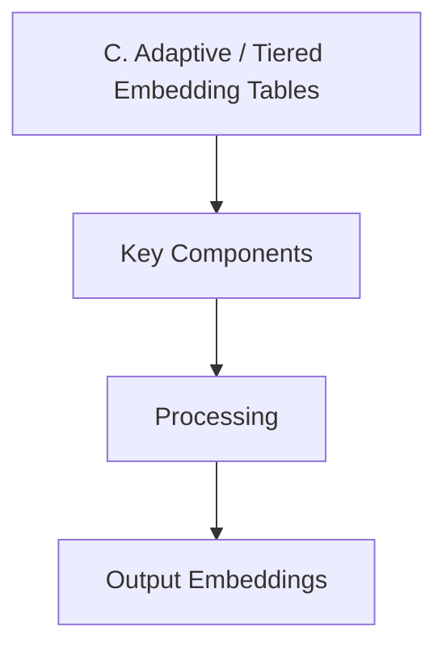

# C. Adaptive / Tiered Embedding Tables

Detailed information about C. Adaptive / Tiered Embedding Tables.

## Architecture / Diagram

```mermaid
graph TD
    A[C. Adaptive / Tiered Embedding Tables] --> B[Key Components]
    B --> C[Processing]
    C --> D[Output Embeddings]
```

[Back to README](../README.md)
