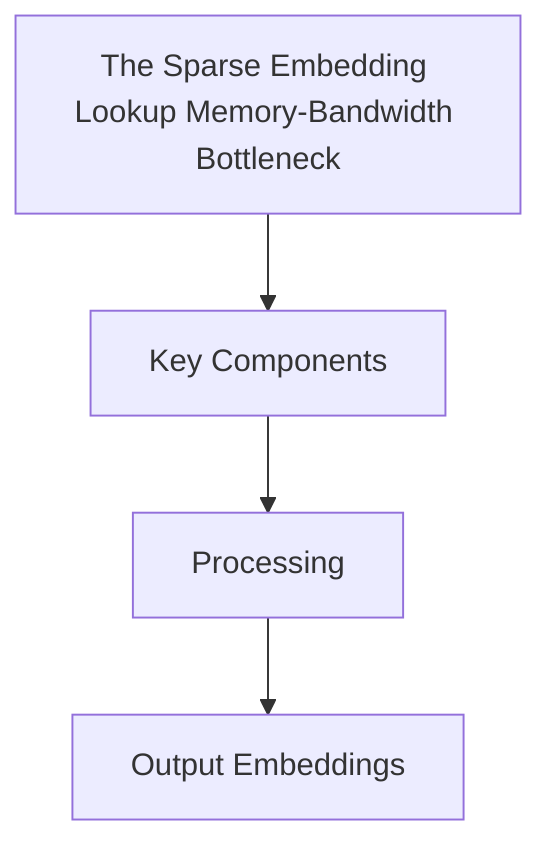

# The Sparse Embedding Lookup Memory-Bandwidth Bottleneck

Detailed information about The Sparse Embedding Lookup Memory-Bandwidth Bottleneck.

## Architecture / Diagram

[Back to README](../README.md)
