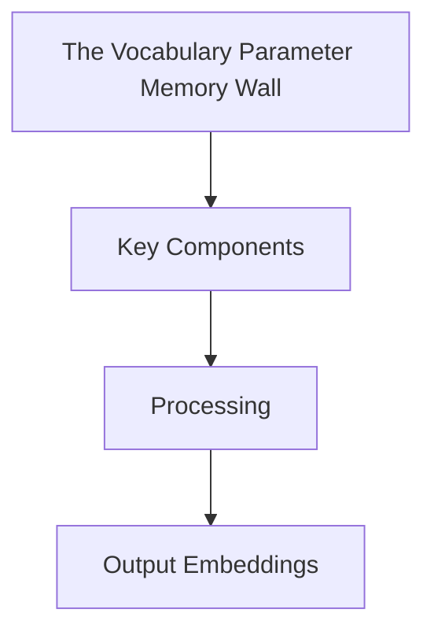

# The Vocabulary Parameter Memory Wall

Detailed information about The Vocabulary Parameter Memory Wall.

## Architecture / Diagram

```mermaid
graph TD
    A[The Vocabulary Parameter Memory Wall] --> B[Key Components]
    B --> C[Processing]
    C --> D[Output Embeddings]
```

[Back to README](../README.md)
